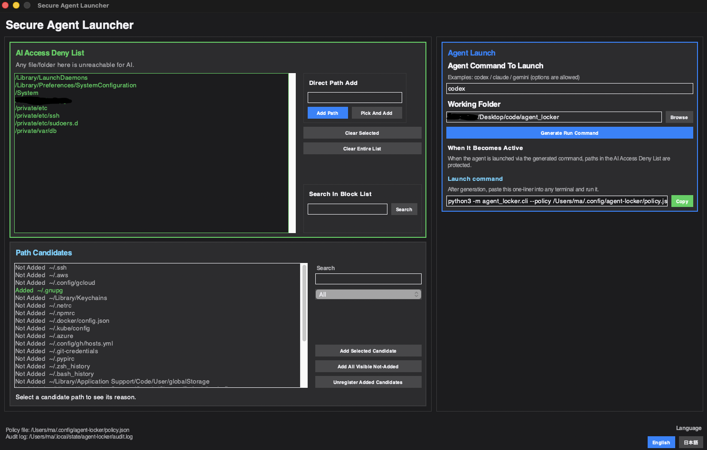

# Secure Agent Launcher



Secure Agent Launcher is a macOS tool that blocks risky AI agent CLI runs (`codex`, `claude`, `gemini`, etc.) before they can touch protected paths.

日本語版: [README.ja.md](README.ja.md)

## What It Does

- lets you register paths you do not want AI tools to touch
- checks paths before command execution and blocks matching runs
- records each blocked or allowed decision in an audit log
- lets you configure settings in the GUI and generate a one-line agent launch command

## User Requirements

- macOS
- `bash`, `curl`, and `tar`

## First Run In 3 Steps

1. Install:

```bash
curl -fsSL https://raw.githubusercontent.com/OWNER/REPO/main/scripts/install-from-github.sh \
  | bash -s -- --repo OWNER/REPO
```

2. Open GUI:

```bash
secure-agent-locker gui
```

3. Add paths in the UI, click `Generate Run Command`, and run the generated line in your terminal.

If a command is blocked, you will see `blocked_path:` in output.

## Install

### Quick install from GitHub Release (recommended)

```bash
curl -fsSL https://raw.githubusercontent.com/OWNER/REPO/main/scripts/install-from-github.sh \
  | bash -s -- --repo OWNER/REPO
```

Installed paths:

- `~/.local/bin/secure-agent-locker`
- `~/.local/bin/secure-agent-locker-uninstall`

If needed, add `~/.local/bin` to your `PATH`.

Install a specific tag:

```bash
bash scripts/install-from-github.sh --repo OWNER/REPO --tag v0.1.0
```

### Local install from source (Python required)

```bash
./scripts/install.sh
```

## Uninstall

```bash
secure-agent-locker-uninstall
```

To remove policy and audit logs too:

```bash
secure-agent-locker-uninstall --purge-config
```

## Files

- Policy JSON: `~/.config/secure-agent-locker/policy.json`
- Audit log: `~/.local/state/secure-agent-locker/audit.log`
- Audit lock file: `~/.local/state/secure-agent-locker/audit.log.lock`
- Rotated audit logs: `audit.log.1` to `audit.log.3` (rotation starts at ~2MB)

## Quick Start (GUI)

```bash
secure-agent-locker gui
```

1. Add paths to protect in `AI Access Deny List` (left panel).
2. Enter the agent command and working folder (right panel).
3. Click `Generate Run Command`.
4. Copy the generated one-liner and run it in any terminal.

Notes:

- The GUI does not auto-launch an external terminal.
- The generated command uses the installed `secure-agent-locker` launcher when available.
- If the preflight check detects a blocked path, command generation is stopped.
- The GUI runs in fixed-size window mode and blocks fullscreen shortcuts.

## CLI Usage

Initialize default policy:

```bash
secure-agent-locker init
```

Show current policy JSON:

```bash
secure-agent-locker show
```

Manage deny paths:

```bash
secure-agent-locker policy list
secure-agent-locker policy add ~/.ssh ~/.aws
secure-agent-locker policy remove ~/.aws
secure-agent-locker policy status
secure-agent-locker policy on
secure-agent-locker policy off
```

Dry-run (check only):

```bash
secure-agent-locker run -- codex
```

Actual execution:

```bash
secure-agent-locker run --execute -- codex
```

With explicit working directory:

```bash
secure-agent-locker run --execute --cwd ~/work/project -- codex --model gpt-5
```

## Behavior Summary

- `run` checks command paths against `deny_paths`.
- Any match returns blocked result with exit code `25`.
- `run` without `--execute` is dry-run only.
- `--timeout-sec` must be a positive integer.
- If `AGENT_LOCKER_TEST_MODE=1`, execution is blocked with exit code `26`.
- Every run decision is appended to the audit log.

## Release Flow (GitHub)

Tag and publish a release on GitHub.  
The workflow at `.github/workflows/release-macos.yml` automatically builds and uploads:

- `secure-agent-locker-macos-arm64.tar.gz`
- `secure-agent-locker-macos-x64.tar.gz`

Users can install the latest release binary with `scripts/install-from-github.sh` and do not need Python.

## Developer Setup (Python)

```bash
python3 -m venv .venv
source .venv/bin/activate
pip install -e .
```

## Run Tests

```bash
python3 -m unittest discover -s tests -v
```

## License

MIT License. See [LICENSE](LICENSE).
